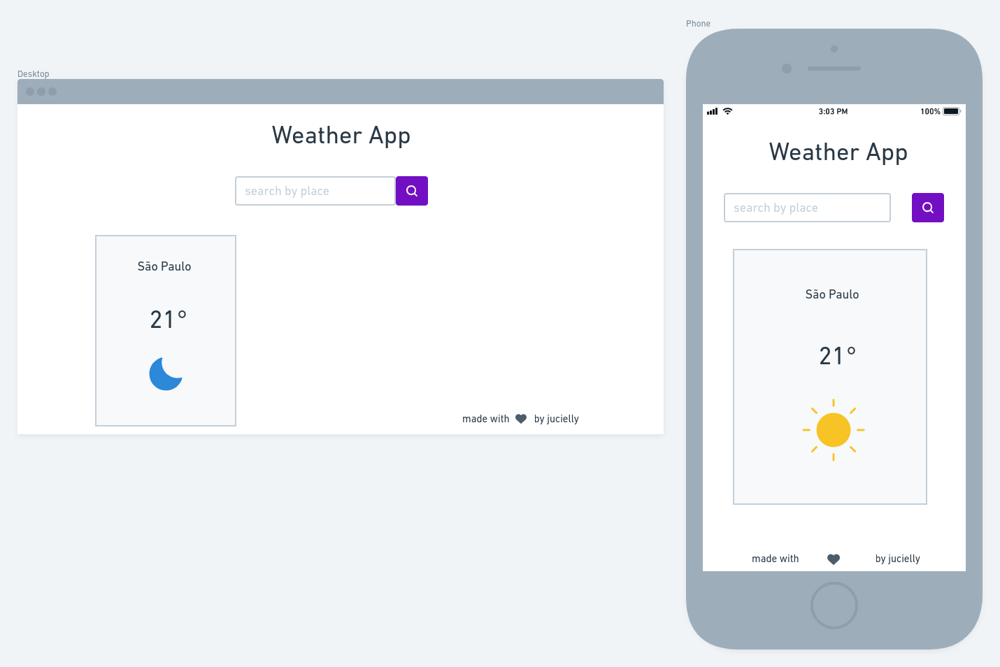

# My Weather App

A weather application to get the temperature, weather condition and whether of a particular city using OpenWeather map. A free weather api.

## Planning

### wireframe

- first, I started designing the application and how I would like it to look

**Result**

- then I did the planning and user stories on notion, you can check it out [here](https://www.notion.so/d0a208d1277a41318067a8139aa18bbf?v=dee04b3aa0454c0b82791532189f0f70)

### tecs

- ES6
- HTML
- CSS/SASS

ESLINT for linting

